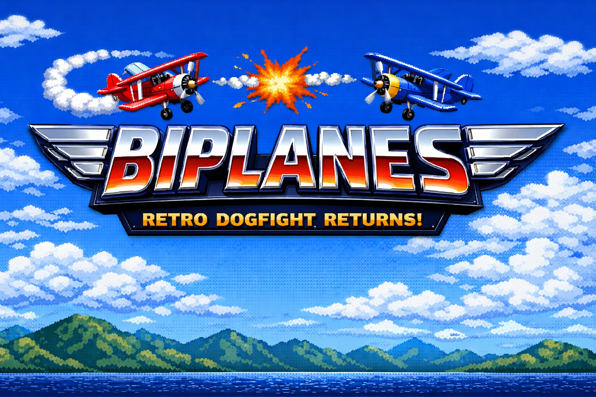

  

<h1 align="center">✈️ BIPLANES</h1>

Reviving the legendary Java mobile dogfight game

  

---

# 🇷🇺 Русская версия

## ✈️ Что такое BIPLANES?

**BIPLANES** — это возрождение культовой ретро-игры с кнопочных телефонов эпохи **Java (J2ME)**.

Если вы помните времена **Nokia, Siemens и Sony Ericsson**, то наверняка играли в подобные игры.  
Два самолета. Ограниченная арена. Бесконечные виражи и попытки перехитрить соперника.

Теперь эта классика возвращается.

---

## 📥 Скачать APK

Скачайте последнюю версию **BIPLANES** напрямую из раздела GitHub Releases.

👉 **[Скачать последнюю версию APK](https://github.com/yourusername/biplanes/releases/latest)**

---

## 🎮 Геймплей

  

Игроки управляют самолетами и оставляют за собой траектории движения.  
Цель — **заставить противника врезаться**, избегая столкновения самому.

Просто?  
Да.

Легко победить?  
Не всегда.

---

## 🚀 Возможности

- ✈️ **Классический геймплей оригинальной игры**
- 👤 **Одиночная игра**
- 👥 **Мультиплеер по Bluetooth**
- 📱 **Атмосфера Java-игр 2000-х**
- ⚡ **Быстрые и динамичные матчи**
- 🤖 **ИИ активно использовался при разработке**

---

## 🧠 Почему этот проект появился

Когда-то подобные игры были **частью культуры кнопочных телефонов**.

Этот проект — попытка:

- сохранить дух той эпохи
- вернуть старую игровую механику
- сделать её доступной сегодня

---

## 🔧 Технологии

В разработке активно использовались современные инструменты и **искусственный интеллект**, который помог ускорить разработку, генерацию кода и эксперименты с игровыми механиками.

---

## 🎯 Планы развития

- 🌐 Онлайн мультиплеер
- 🗺️ Новые карты
- 🏆 Таблица лидеров
- 🎮 Новые режимы игры

---

# 🇬🇧 English Version

## ✈️ What is BIPLANES?

**BIPLANES** is a revival of a legendary retro game from the era of **Java (J2ME) feature phones**.

If you remember the days of **Nokia, Siemens, and Sony Ericsson**, you probably remember games like this.

Two planes.  
One arena.  
Pure skill and strategy.

Now this classic is back.

---

## 📥 Download APK

Download the latest version of **BIPLANES** directly from GitHub Releases.

👉 **[Download Latest APK](https://github.com/yourusername/biplanes/releases/latest)**

---

## 🎮 Gameplay

  

Players control planes flying inside a closed arena, leaving trails behind them.

The objective is simple:

Make your opponent crash while avoiding collisions yourself.

Easy to learn.  
Hard to master.

---

## 🚀 Features

- ✈️ **Classic gameplay inspired by the original game**
- 👤 **Single player mode**
- 👥 **Bluetooth multiplayer**
- 📱 **Authentic early-2000s mobile game vibe**
- ⚡ **Fast and addictive matches**
- 🤖 **AI-assisted development**

---

## 🧠 Why this project exists

Games like this were part of the **feature phone gaming culture**.

This project aims to:

- preserve the spirit of that era
- revive a forgotten gameplay style
- bring it back for modern players

---

## 🔧 Development

The project was developed with the help of **artificial intelligence**, which assisted with coding, experimentation, and iteration.

---

## 🎯 Roadmap

- 🌐 Online multiplayer
- 🗺️ New maps
- 🏆 Leaderboards
- 🎮 New game modes

---
## 📱 Installation

1. Download the APK file
2. Allow **installation from unknown sources**
3. Install the APK
4. Launch **BIPLANES**
5. Enjoy retro dogfights ✈️

---

## 🎮 Multiplayer

You can play:

- 👤 **Singleplayer**
- 👥 **Local multiplayer via Bluetooth**

Challenge your friends and see who is the best pilot.

---

## ⚠️ Requirements

- Android 7.0+
- Bluetooth for multiplayer mode

Made with ❤️ for retro gaming fans

